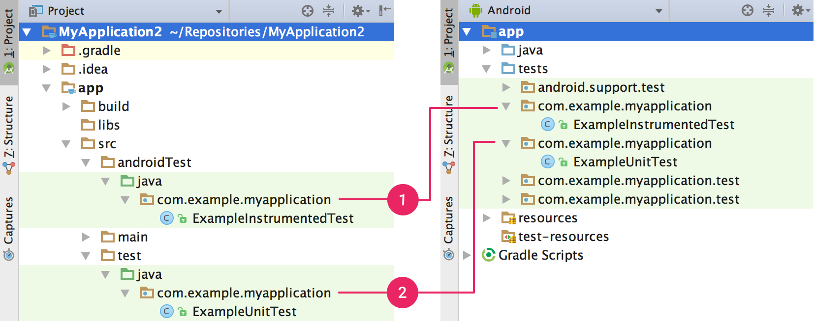

Android Studio旨在簡化測試。只需點擊幾下，您可以設置在本地JVM上運行的JUnit測試或在設備上運行的檢測測試。當然，您還可以通過集成測試框架（例如Mockito）在本地單元測試中測試Android API調用，以及使用Espresso或UI Automator在測試的測試中執行用戶交互來擴展測試功能。您可以使用Espresso測試記錄器自動生成Espresso測試。 此頁面提供有關如何向您的應用添加新測試並從Android Studio運行它們的基本信息。 有關編寫測試的更完整的操作指南，請參閱[測試入門](https://developer.android.com/training/testing/start/index.html)。

## 測試類型和位置 

測試代碼的位置取決於您編寫的測試類型。 Android Studio提供了源代碼目錄（源集），用於以下兩種類型的測試： 

### 本地單元測試 

>位於module-name / src / test / java /。 

>這些是在計算機的本地Java虛擬機（JVM）上運行的測試。當您的測試沒有Android框架依賴項或者可以模擬Android框架依賴項時，使用這些測試來最小化執行時間。 在運行時，這些測試是針對一個修改版本的android.jar執行的，其中所有的最終修飾符都被刪除了。這允許你使用流行的模擬庫，如Mockito。 

### 儀表測試 

>位於module-name / src / androidTest / java /。 

>這些是在硬件設備或仿真器上運行的測試。這些測試可以訪問Instrumentation API，您可以訪問諸如您要測試的應用程序的上下文等信息，並讓您通過測試代碼控制要測試的應用程序。在編寫集成和功能UI測試以自動執行用戶交互時，或者當測試具有模仿對像不能滿足的Android依賴項時，可以使用這些測試。 

>由於測試版測試內置於APK（與應用程式APK分開），因此必須有自己的AndroidManifest.xml檔案。但是，Gradle在構建期間自動生成此文件，因此它在項目源集中不可見。如果需要，您可以添加自己的清單文件，例如為`minSdkVersion`指定一個不同的值，或者為您的測試註冊運行監聽器。

在構建應用程序時，Gradle將多個清單文件合併到一個清單中。 Gradle構建以與為項目的應用程序源集合相同的方式解釋這些測試源集合，這允許您基於構建變體創建測試。 
當您創建新項目或添加應用程序模塊時，Android Studio創建上面列出的測試源集，並在每個測試文件中包含一個示例測試文件。您可以在項目窗口中看到它們，如圖1所示。


Figure 1. Your project's (1) instrumented tests and (2) local JVM tests are visible in either the Project view (left) or Android view (right).


## 添加新測試

要創建本地單元測試或儀器測試，可以按照以下步驟為特定類或方法創建新測試： 
1. 打開包含要測試的代碼的Java文件。 
2. 單擊要測試的類或方法，然後按Ctrl + Shift + T（⌘⌘T）。 
3. 在出現的菜單中，單擊創建新測試。 
4. 在“創建測試”對話框中，編輯任何字段並選擇要生成的任何方法，然後單擊“確定”。 
5. 在“選擇目標目錄”對話框中，單擊與要創建的測試類型相對應的源集合：androidTest用於儀器測試或測試用於本地單元測試。然後單擊“確定”。 

或者，您可以在適當的測試源集中創建一個通用Java文件，如下所示： 

1. 在左側的項目窗口中，單擊下拉菜單並選擇項目視圖。 
2. 展開相應的模塊文件夾和嵌套的src文件夾。要添加本地單元測試，請展開測試文件夾和嵌套的java文件夾;要添加一個檢測測試，展開androidTest文件3. 夾和嵌套的java文件夾。 
4. 右鍵單擊Java包目錄，然後選擇“新建”>“Java類”。 命名文件，然後單擊確定。 

還要確保在應用程序模塊的build.gradle文件中指定測試庫依賴關係：

```java
dependencies {
    // Required for local unit tests (JUnit 4 framework)
    testCompile 'junit:junit:4.12'

    // Required for instrumented tests
    androidTestCompile 'com.android.support:support-annotations:24.0.0'
    androidTestCompile 'com.android.support.test:runner:0.5'
}
```
## 為構建變量創建檢測測試 

如果項目包括具有唯一源集的構建變體，則可能需要對應的檢測測試源集。在對應於構建版本的源集合中創建測試測試有助於保持測試代碼的有序性，並允許您只運行適用於給定構建版本的測試。 

要為您的構建版本添加測試源集，請按照下列步驟操作： 

1. 在左側的項目窗口中，單擊下拉菜單並選擇項目視圖。 
2. 在相應的模塊文件夾中，右鍵單擊src文件夾，然後單擊新建>目錄。 
3. 對於目錄名稱，請輸入“androidTestVariantName”。例如，如果你有一個名為“MyFlavor”的構建變體，那麼目錄名應該是“androidTestMyFlavor”。然後單擊“確定”。 
4. 右鍵單擊新目錄，然後單擊新建>目錄。 
5. 輸入“java”作為目錄名稱，然後單擊“確定”。 

現在，您可以通過按照上述步驟添加新測試來向此新源集添加測試。當您到達“選擇目標目錄”對話框時，選擇新的變量測試源集。 src / androidTest /源集中的測試測試由所有構建版本共享。當為應用程序的“MyFlavor”變體構建測試APK時，Gradle結合了src / androidTest /和src / androidTestMyFlavor / source集合。 

例如，下表顯示了工具測試文件應如何駐留在與應用代碼源集對應的源集中。

|Path to app class	|Path to matching instrumentation test class|
|:----|:----|
|src/main/java/Foo.java	|src/androidTest/java/AndroidFooTest.java|
|src/myFlavor/java/Foo.java	|src/androidTestMyFlavor/java/AndroidFooTest.java|

正如它為你的應用程序源集所做的，Gradle構建合併和覆蓋來自不同的測試源集的文件。在這種情況下，“androidTestMyFlavor”源集中的AndroidFooTest.java文件覆蓋“androidTest”源集中的版本。有關合併源集合的更多信息，請參閱配置構建。 

你應該使用構建變體為你的應用程序和測試源集的另一個原因是通過模擬依賴創建氣密測試。也就是說，您可以為您的應用程序創建包含依賴項的假實現（例如網絡請求或通常為flaky的設備傳感器數據）的產品風格，然後添加相應的模擬測試源集。有關詳細信息，請參閱有關利用產品風格進行氣密測試的博客文章。 

運行測試 

要運行測試，請執行以下操作： 
1. 通過單擊工具欄中的同步項目，確保您的項目與Gradle同步。 
2. 使用以下方法之一運行測試： 
    + 在項目窗口中，右鍵單擊測試，然後單擊運行。 
    + 在代碼編輯器中，右鍵單擊測試文件中的類或方法，然後單擊運行以測試類中的所有方法。 
    + 要運行所有測試，請右鍵單擊測試目錄，然後單擊運行測試。 

默認情況下，您的測試使用Android Studio的默認運行配置運行。如果要更改某些運行設置（如檢測運行程序和部署選項），可以在運行/調試配置對話框中編輯運行配置（單擊運行>編輯配置）。 

## 更改測試構建類型 

默認情況下，所有測試都針對調試版本類型運行。您可以使用模塊級build.gradle文件中的testBuildType屬性將其更改為另一個構建類型。例如，如果要針對“臨時”構建類型運行測試，請編輯文件，如下面的代碼段所示。

```yaml
android {
    ...
    testBuildType "staging"
}
```